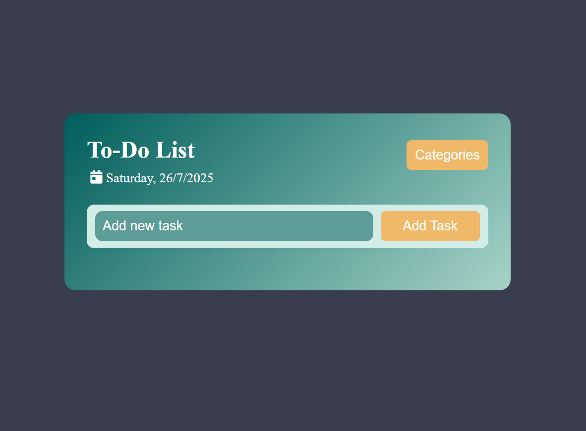
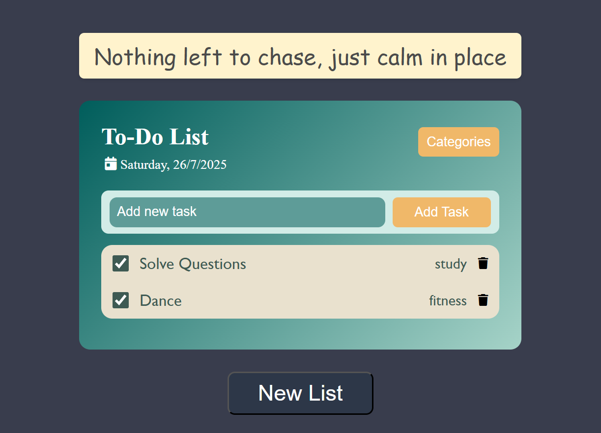

# ✅ To-Do List Web App

A responsive and interactive **To-Do List** application built using **HTML**, **CSS**, and **JavaScript**. This project allows users to add, delete, and manage tasks with ease. It also dynamically displays the **current date and day** at the top of the page to help users stay oriented and plan better. When all tasks are completed, a sweet poetic message is displayed along with an option to start a new list — bringing both functionality and a touch of creativity!

---

## ✨ Features

- ➕ **Add Tasks** quickly with a simple input field  
- 🗑️ **Delete Tasks** when no longer needed  
- 📅 **Displays Current Date and Day** at the top for better task planning 
- 📱 **Fully Responsive** design for mobile, tablet, and desktop  
- ✅ **Check off** tasks as you complete them  
- 🌟 **Completion Message** – when all tasks are done, you’ll be greeted with a poetic quote and an option to **start fresh** with a new list  
- 🎨 Stylish, minimal UI with smooth interactions

---

## 🛠️ Tech Stack

- **HTML5** – structure  
- **CSS3** – styling and layout  
- **JavaScript (Vanilla)** – interactivity and DOM manipulation
- Dynamic **Date & Day Rendering** using JavaScript's `Date` object

---

### 📸 Demo

🌐 [Live Demo](https://vidushi-coder.github.io/ToDoList-WebApp/ToDoList.html) 

---

### 📸 Project Preview

  
  

---

## 📁 Project Structure

ToDoList-WebApp/  
├── ToDoList.html  
├── ToDoList.css  
└── ToDoList.js